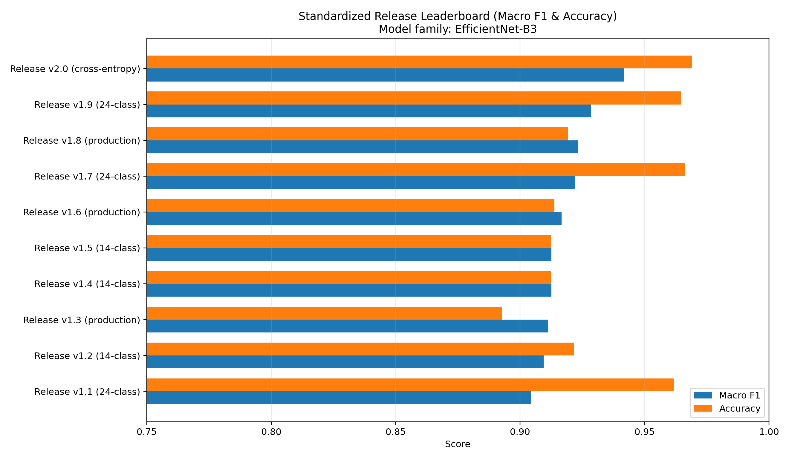
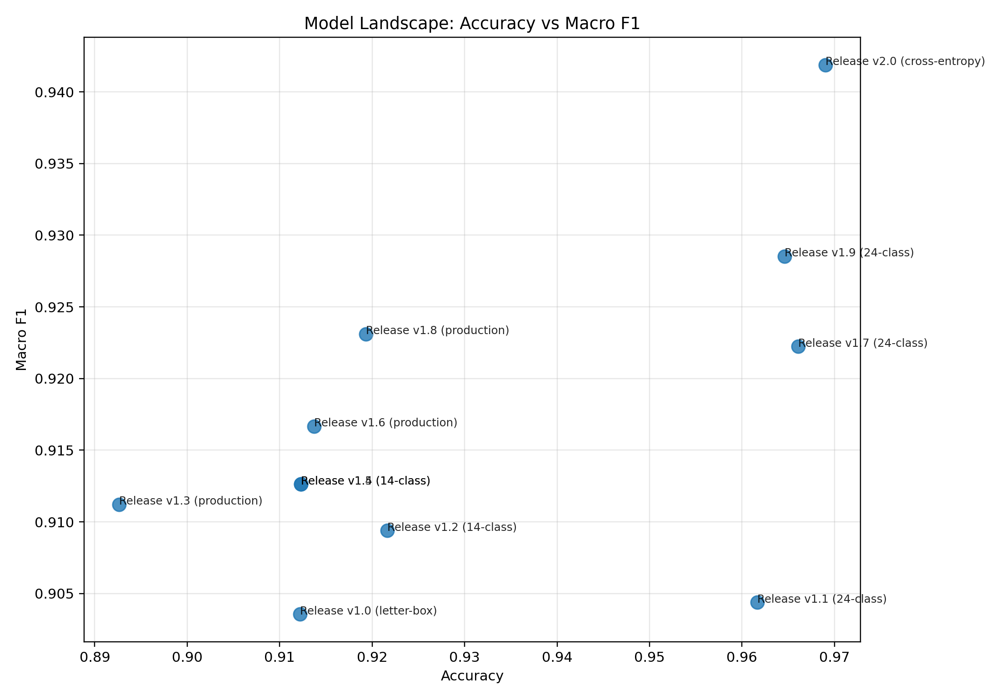
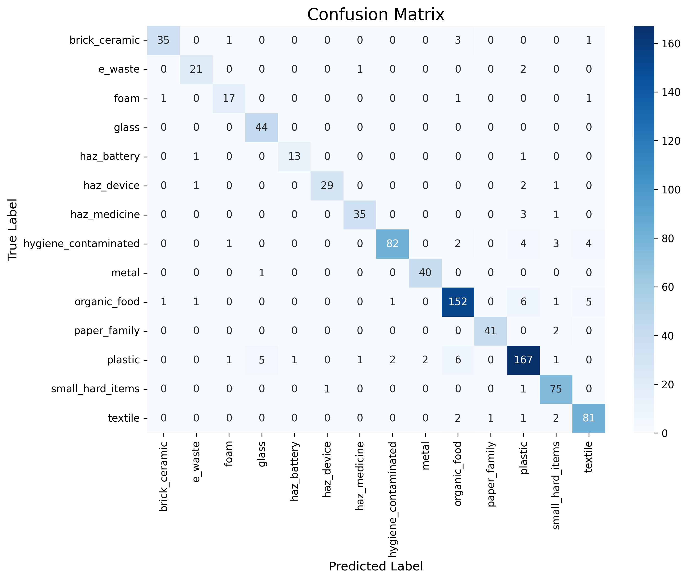
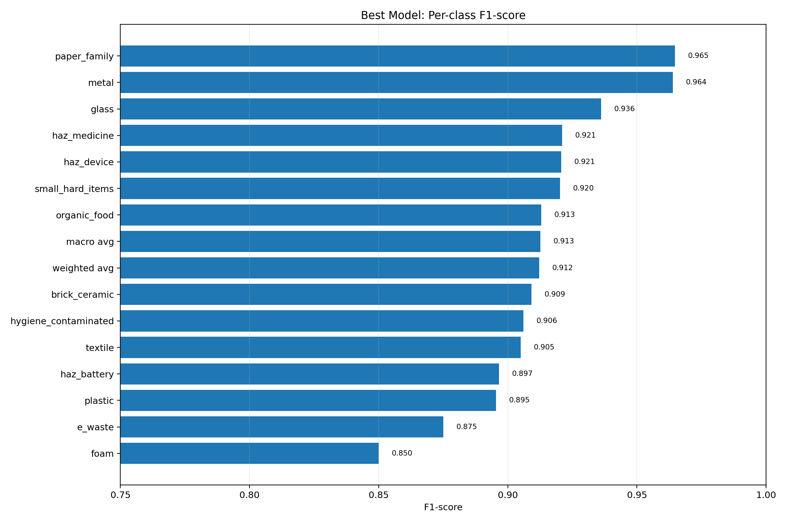
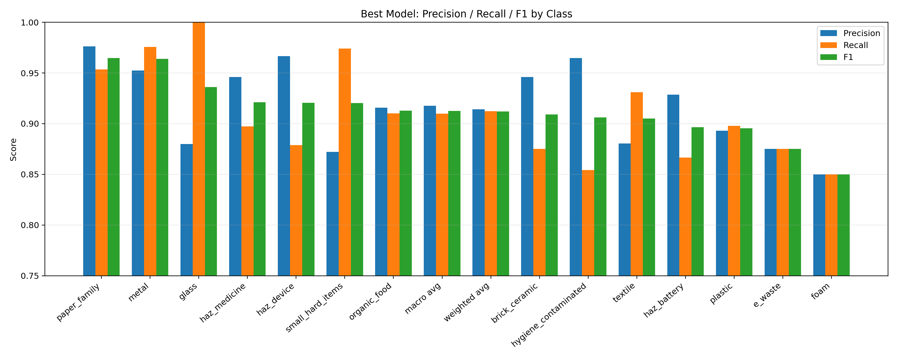
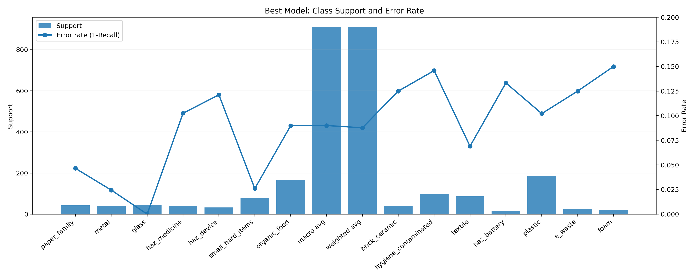
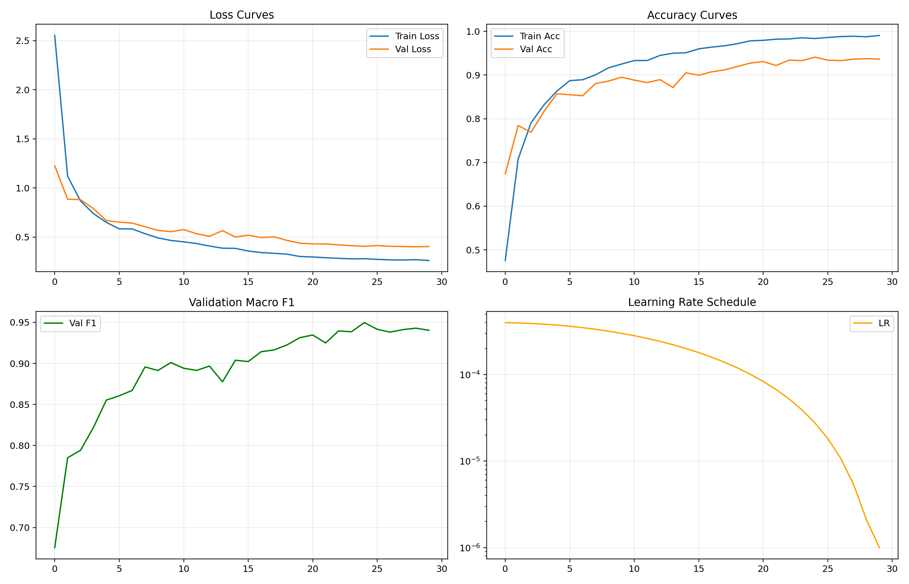
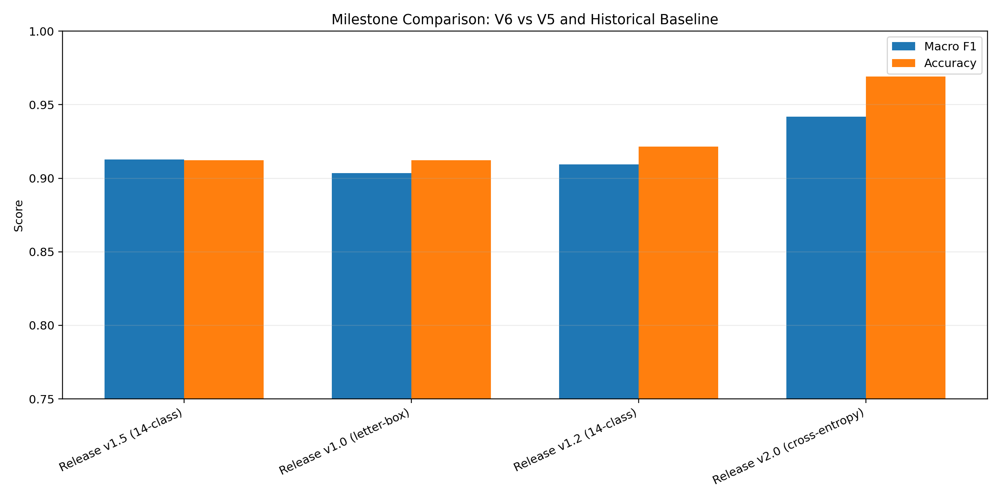

# ♻️ EcoSort: Edge-Cloud Waste Classification for Real-World Deployment

[](https://students-cs-ecosort-14class-demo.hf.space/)
[](https://www.python.org/downloads/)
[](#)
[](https://opensource.org/licenses/MIT)

Live Demo: https://students-cs-ecosort-14class-demo.hf.space/

---

## Project Summary

EcoSort is a student-built computer vision system designed to classify everyday waste under realistic constraints, not only benchmark-friendly conditions. The project focuses on practical engineering decisions: class remapping, robust preprocessing, edge-ready inference, and cloud-assisted fallback when confidence is low.

This repository includes end-to-end components:

- data and mapping configurations,
- training and evaluation pipelines,
- a Flask inference backend,
- an interactive demo interface,
- deployment-ready model packaging.

The core objective is to make waste classification reliable in real usage scenarios, where images are noisy, classes are imbalanced, and deployment resources are limited.

---

## Why This Project Matters

Many waste classification demos report high accuracy on simplified datasets but fail in real environments. EcoSort was built to close that gap. The project addresses four practical challenges:

1. **Taxonomy mismatch** between research datasets and local sorting behavior.
2. **Class imbalance and distribution shift** that inflate benchmark metrics.
3. **Edge inference constraints** in memory, latency, and model size.
4. **Ambiguous samples** that require human-in-the-loop or cloud verification.

Instead of optimizing only for one headline metric, EcoSort prioritizes robustness and deployment feasibility.

---

## Technical Contributions

### 1) Data-Centric Taxonomy Engineering

The class design evolved from broad category baselines to a practical 14-class scheme for daily usage. Several classes were merged or split based on visual confusion and disposal semantics.

Examples:

- Hazard-like chemicals were merged into plastic-related handling where visual overlap dominated errors.
- A mixed residual class was decomposed into more consistent subgroups such as `small_hard_items`, `foam`, and `brick_ceramic`.
- Hygiene-contaminated classes were grouped for operational relevance.

This remapping reduced confusion concentration and improved per-class stability.

### 2) EfficientNet-B3 for Edge-Oriented Inference

The final model family centers on EfficientNet-B3 due to favorable performance-to-compute trade-offs. The architecture choice balances representation power and deployment practicality.

### 3) Letterbox Preprocessing for Aspect-Ratio Robustness

EcoSort uses longest-side resize with padding to preserve object shape cues for elongated or irregular items. This is critical for classes where geometric distortion from naive resizing causes systematic errors.

### 4) Edge-Cloud Cascade Design

Local inference serves as the primary path for speed and cost control. A cloud VLM fallback can be triggered for difficult cases, creating a practical reliability layer without forcing all requests through a remote model.

### 5) Feedback Loop for Continuous Improvement

The demo includes edge-case reporting to capture misclassifications and uncertain samples, enabling iterative dataset updates and future model versions.

---

## Repository Structure

```text
ecosort/
├── backend/                # Flask API for inference and optional VLM fallback
├── src/                    # Core modules: data, models, train, utils
├── experiments/            # Training and evaluation entry points
├── configs/                # Model, training, and mapping configurations
├── scripts/                # Utility scripts for automation and analysis
├── docs/                   # Technical notes, reports, and guides
├── checkpoints/            # Experiment outputs and analysis artifacts (DVC-oriented)
├── data/                   # Local data workspace
├── streamlit_demo.py       # Demo app
├── environment.yml         # Conda environment definition
└── requirements.txt        # Pip dependency list
```

---

## Quick Start

### 1) Environment Setup

```bash
conda env create -f environment.yml
conda activate ecosort
pip install -r requirements.txt
```

### 2) Training

```bash
python experiments/train_baseline.py \
  --config configs/efficientnet_b3.yaml \
  --data-root data/proc
```

### 3) Evaluation

```bash
python experiments/evaluate.py \
  --checkpoint checkpoints/<exp_name>/best_model.pth \
  --data-root data/proc \
  --model-type efficientnet
```

### 4) Run Backend API

```bash
python backend/app.py
```

### 5) Run Demo

```bash
streamlit run streamlit_demo.py
```

---

## Quantitative Results

The following figures summarize model selection and diagnostics for application-style reporting. Labels in comparison plots are standardized as release aliases (`v1.0` to `v2.0`) to improve readability.

### A. Leaderboard Across Candidate Models



This chart compares macro-F1 and accuracy across multiple training configurations under a consistent evaluation protocol. It highlights ranking differences that are not visible from single-metric reporting.

### B. Accuracy–Macro-F1 Landscape



The scatter view reveals the performance frontier and the stability region of candidate models. It supports rational model selection beyond isolated best-case claims.

---

## Best Model Diagnostics

### C. Confusion Matrix (Best Model)



This matrix shows where errors are concentrated and which class boundaries remain difficult. It is used to prioritize future data augmentation and taxonomy refinement.

### D. Per-Class F1



Per-class F1 demonstrates class-wise robustness and helps verify that gains are not dominated only by majority classes.

### E. Precision / Recall / F1 by Class



This grouped breakdown gives a complete reliability profile for each class, especially useful for high-cost misclassification categories.

### F. Class Support vs Error Rate



This figure links data distribution to model behavior, showing where limited support still causes elevated error risk.

---

## Training Dynamics and Milestones

### G. Training Curves of the Final Candidate



The curves indicate stable optimization behavior and help validate that final metrics are not artifacts of unstable training.

### H. Milestone Comparison Across Iterations



This timeline-style comparison summarizes progress from earlier baselines to later optimized configurations.

---

## Mapping and Class Definition Notes

The final deployment-oriented taxonomy uses 14 classes and maps fine-grained raw labels into operational groups. This design reflects both visual discriminability and disposal relevance.

Current local model classes:

- `brick_ceramic`
- `e_waste`
- `foam`
- `glass`
- `haz_battery`
- `haz_device`
- `haz_medicine`
- `hygiene_contaminated`
- `metal`
- `organic_food`
- `paper_family`
- `plastic`
- `small_hard_items`
- `textile`

At inference time, classes can also be mapped to coarse categories (`recyclable`, `hazardous`, `kitchen`, `other`) for user-facing guidance.

---

## Engineering Highlights for CS Admissions Context

This project demonstrates practical software and ML engineering skills across the full stack:

- **Data engineering:** custom mapping rules, dataset auditing, and class balancing decisions.
- **Modeling:** architecture selection with explicit compute-performance trade-offs.
- **MLOps mindset:** checkpoint organization, reproducible experiments, and result packaging.
- **Deployment engineering:** lightweight API service, cloud-hosted demo, and large-weight delivery strategy.
- **Human-centered design:** interactive correction loop and fallback path for uncertain predictions.

The project is not a single notebook experiment. It is a multi-stage system with iterative design decisions, measurable trade-offs, and deployment constraints.

---

## Deployment Notes

- The demo is accessible online through Hugging Face Spaces.
- Large model artifacts are managed externally (for example, release assets) instead of bloating the source repository.
- Backend supports environment-based configuration for model path, API keys, and runtime behavior.

---

## Reproducibility and Artifact Policy

- Large datasets and full checkpoints are intentionally not committed as standard Git blobs.
- Experiment outputs are organized under `checkpoints/`.
- Training states should include model weights and optimizer/scheduler context for restartability.
- Mapping and training settings are versioned in `configs/` for traceability.

---

## Limitations

- Long-tail classes still show sensitivity to support size and visual noise.
- Extreme occlusion and multi-object clutter remain difficult in pure single-image classification mode.
- Cloud fallback quality depends on external model behavior and API availability.

---

## Future Work

- Add stronger calibration for confidence-based fallback triggering.
- Expand hard-negative mining and targeted augmentation for confusing class pairs.
- Explore quantization-aware or distillation-based variants for lower-latency edge inference.
- Improve temporal consistency for future video-stream scenarios.
- Integrate richer monitoring for post-deployment drift analysis.

---

## Acknowledgments

This project was developed as part of a student-led effort to bridge machine learning research and practical deployment. The work emphasizes reproducibility, iterative problem solving, and user-facing reliability.

If you are reviewing this repository for academic purposes, the figures in `docs/figures/admissions/` provide a compact overview of experimental outcomes and engineering decisions.
